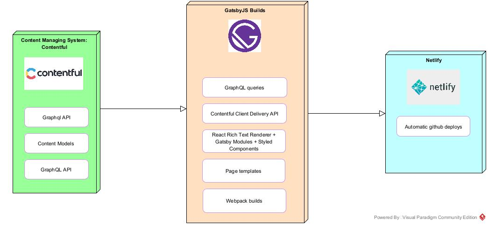

# About

My custom portfolio website and services.
Built using Contentful as "backend" content management system.
Contentful provides a GraphQL API that the Gatsby app fetch data from and render using page templates and webpack for creating builds.
Everything is pushed to Github and Netlify fetches changes in real time with automatic deploys.

## Architecture

## Start development project
Command to run: `env-cmd -f .env gatsby develop`

## Set env variables

Create these files:
* .env.development
* .env.production

These files contain:
* CONTENTFUL_SPACE_ID
* CONTENTFUL_ACCESS_TOKEN
* GATSBY_ENV = "development" or "production"
* TYPEKIT_ID=(adobe font project id)
